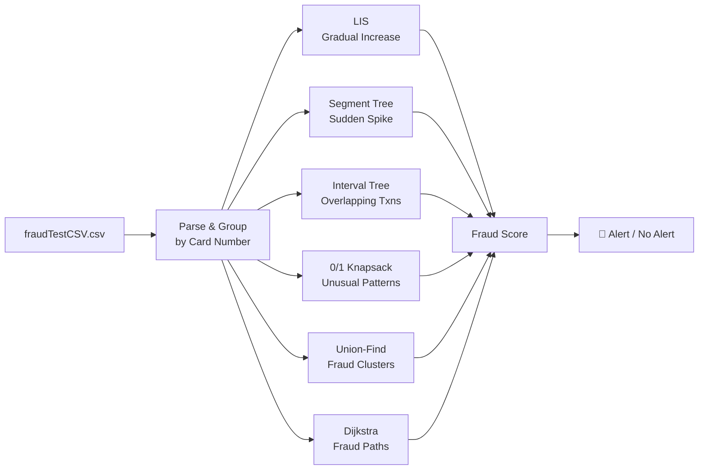

# FrauDfence

A credit card fraud detection system in C++ that applies 6 different algorithmic techniques to detect fraudulent transaction patterns. Reads transaction history from CSV and runs detection algorithms per cardholder and across the entire dataset.

## How It Works



## Detection Algorithms

| # | Algorithm | Data Structure | What it detects |
|---|-----------|---------------|-----------------|
| 1 | LIS | Dynamic Programming | Gradually increasing transaction amounts over time |
| 2 | Segment Tree | Segment Tree | Sudden spending spike (10× the average of last 5 transactions) |
| 3 | Interval Tree | Interval Tree | Two transactions at nearly the same time (potential card cloning) |
| 4 | 0/1 Knapsack | DP | Spending patterns that max out the credit limit |
| 5 | Kruskal's | Union-Find + Haversine | Geographic clusters of fraud within 1 hour / 223 km |
| 6 | Dijkstra | Adjacency List | Indirect fraud connections via merchant proximity |

## Compilation & Usage

```bash
# Prerequisites: unzip the transaction data
unzip fraudTestCSV.zip

# Compile
g++ -std=c++17 -O2 finalMain.cpp -o finalMain

# Run
./finalMain
```

The CSV must be extracted to `fraudTestCSV.csv` in the same directory before running.

## Data

The `fraudTestCSV.zip` contains synthetic credit card transaction data. Use `data.py` to import it into a MySQL database if needed (requires local MySQL setup).

## Menu

| # | Option |
|---|--------|
| 1 | Gradual Increase Fraud (LIS) |
| 2 | Sudden Spike in Spending (Segment Tree) |
| 3 | Overlapping Transactions (Interval Tree) |
| 4 | Unusual Spending Pattern (Knapsack) |
| 5 | Fraud Clusters (Union-Find) |
| 6 | Indirect Fraud Paths (Dijkstra) |
| 7 | Exit |
